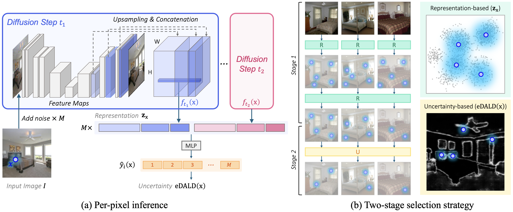

# Diffusion-Driven Two-Stage Active Learning for Low-Budget Semantic Segmentation

This repository provides the official PyTorch implementation for [Diffusion-Driven Two-Stage Active Learning for Low-Budget Semantic Segmentation](https://arxiv.org/pdf/2510.22229) (NeurIPS 2025).


## Abstract
Semantic segmentation demands dense pixel-level annotations, which can be prohibitively expensive — especially under extremely constrained labeling budgets. In this paper, we address the problem of low-budget active learning for semantic segmentation by proposing a novel two-stage selection pipeline. Our approach leverages a pre-trained diffusion model to extract rich multi-scale features that capture both global structure and fine details. In the first stage, we perform a hierarchical, representation-based candidate selection by first choosing a small subset of representative pixels per image using MaxHerding, and then refining these into a diverse global pool. In the second stage, we compute an entropy-augmented disagreement score (eDALD) over noisy multi-scale diffusion features to capture both epistemic uncertainty and prediction confidence, selecting the most informative pixels for annotation. This decoupling of diversity and uncertainty lets us achieve high segmentation accuracy with only a tiny fraction of labeled pixels. Extensive experiments on four benchmarks (CamVid, ADE-Bed, Cityscapes, and Pascal-Context) demonstrate that our method significantly outperforms existing baselines under extreme pixel-budget regimes.



## Environment Setup
```bash
cd two-stage-edald
conda create -n ts-edald python=3.8 -y
conda activate ts-edald
pip install -r requirements.txt
```
## Pretrained Models
We use 256x256 class-unconditional diffusion models from [guided-diffusion](https://github.com/openai/guided-diffusion). We use *lsun_bedroom* for ADE-Bed and *imagenet_256* for the remaining datasets. Download and place them in `checkpoints/`.

- *imagenet_256*: [256x256_diffusion_uncond.pt](https://openaipublic.blob.core.windows.net/diffusion/jul-2021/256x256_diffusion_uncond.pt)
- *lsun_bedroom*: [lsun_bedroom.pt](https://openaipublic.blob.core.windows.net/diffusion/jul-2021/lsun_bedroom.pt)

## Datasets
Please follow the instructions in the `preprocess/` directory for downloading and preprocessing the datasets. Detailed steps and scripts for each dataset (e.g., CamVid, Cityscapes) are provided there.

## Train & Evaluation

To run the active learning loop, simply execute the corresponding shell script. For example:

```bash
bash scripts/camvid.sh
```

Note: If your dataset or pretrained model is located in a different directory, please update the relevant paths in `args.py` before running the scripts.

## Citation
```bibtex
@article{kim2025diffusion,
  title={Diffusion-Driven Two-Stage Active Learning for Low-Budget Semantic Segmentation},
  author={Jeongin Kim and Wonho Bae and YouLee Han and Giyeong Oh and Youngjae Yu and Danica J. Sutherland and Junhyug Noh},
  year={2025},
  journal={arXiv preprint arXiv:2510.22229},
  eprint={2510.22229},
  primaryClass={cs.CV},
  url={https://arxiv.org/abs/2510.22229}, 
}
```

## Acknowledgement
Core components are adapted from [PixelPick](https://github.com/noelshin/PixelPick). Many thanks to the authors for sharing their valuable codebase.